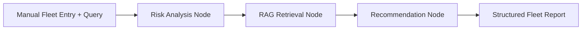

# FleetAI Agentic Fleet Management Assistant

An end-sem ready **GenAI + Agentic AI** project that autonomously analyzes fleet vehicle health, retrieves maintenance guidelines using RAG, and generates structured servicing recommendations.

## Key Features

- **Agentic Workflow (LangGraph):** Stateful multi-step reasoning pipeline.
- **RAG Integration (Chroma):** Guideline retrieval for grounded recommendations.
- **Structured Outputs:** Health summary + action plan in consistent schema.
- **Modern Dark UI:** Professional Streamlit dashboard for fleet operators.
- **Responsible AI:** Safety disclaimer + conservative fallback behavior.

## Architecture (High-Level)



## Input and Output

### Input
- Fleet table with:
  - `vehicle_id`
  - `mileage`
  - `engine_temperature`
  - `oil_quality`
  - `brake_wear`
  - `battery_health`
  - `days_since_last_service`
- Maintenance query from user

### Output
- **Problem Understanding**
- **Health Summary** (risk and confidence per vehicle)
- **Action Plan** (service, timeline, priority, rationale)
- **Sources** (retrieved maintenance guideline chunks)
- **Safety Disclaimer**

## Project Structure

```text
.
├── app.py
├── fleet_ai_notebook.ipynb
├── requirements.txt
├── .env.example
├── data/
│   └── maintenance_guidelines.txt
├── docs/
│   └── agent_workflow.md
├── report/
│   └── main.tex
└── src/
    ├── __init__.py
    ├── prompts.py
    ├── rag.py
    ├── risk.py
    ├── schemas.py
    ├── state.py
    └── workflow.py
```

## Setup

1. **Create virtual environment**
   ```bash
   python3 -m venv .venv
   source .venv/bin/activate
   ```
2. **Install dependencies**
   ```bash
   pip install -r requirements.txt
   ```
3. **Configure environment**
   ```bash
   cp .env.example .env
   ```
   Add your Groq key in `.env`:
   - `LLM_PROVIDER=groq`
   - `LLM_MODEL=llama-3.1-8b-instant`
   - `GROQ_API_KEY=...`

## Run Locally

```bash
streamlit run app.py
```

Open the local URL shown in terminal and:
- enter fleet values directly in table fields,
- enter maintenance query,
- click **Run Agent Workflow**.

## Notebook Version

If you want Jupyter-based execution:
- open `fleet_ai_notebook.ipynb`
- run cells to execute the same LangGraph workflow without the UI

## Deployment

You can deploy directly to:
- [Streamlit Community Cloud](https://streamlit.io/cloud)
- [Hugging Face Spaces](https://huggingface.co/spaces)

For submission, include:
- hosted link,
- GitHub repository,
- 5-minute demo video,
- PDF from LaTeX report.

## Evaluation Notes (Rubric Alignment)

- **Technical Implementation:** LangGraph + RAG + structured recommendations.
- **Code Quality:** Modular separation of state, risk, retrieval, and orchestration.
- **Hosted Demo:** Streamlit-ready deployment with robust fallback.
- **Project Report:** `report/main.tex` includes research-style template.
- **Video:** UI and workflow are designed for clean walkthrough demonstrations.

## Disclaimer

This application provides decision support only. Final maintenance actions must be approved by certified automotive professionals and operational safety policies.
